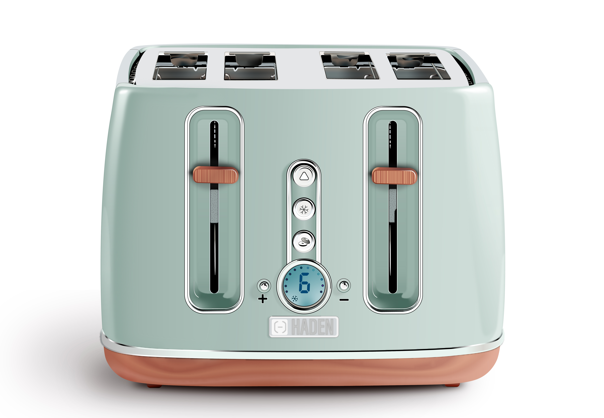
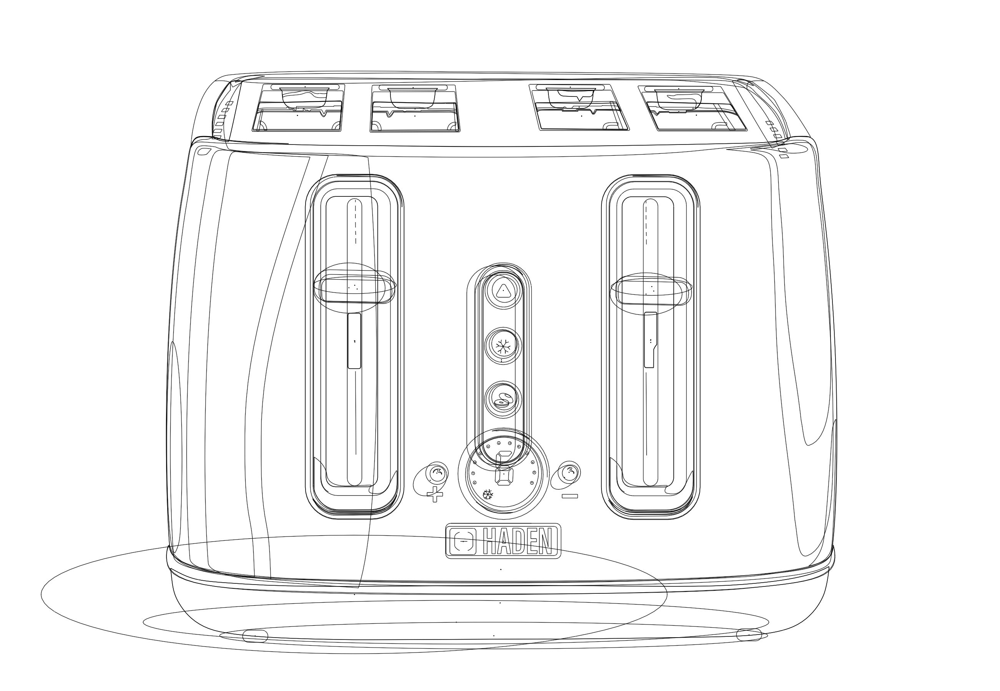
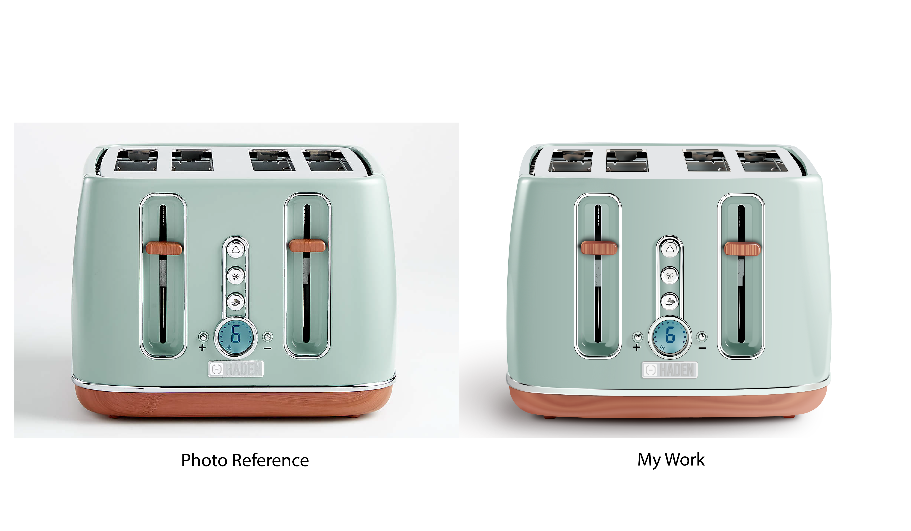

## Goal
The goal of this project was to create a photorealistic drawing of a mechanical object using Adobe Illustrator. 

## Process
Firstly I needed to gather some examples of photos of objects I would like to recreate. I chose several pictures and, upon the instructor's approval, decided to work with the photo of the HADEN toaster. The object didn't have too many details, but I decided to try to make it look truly photorealistic. It was rather challenging, as I had to recreate not only shapes but also complex gradients and textures. It required a great amount of time and concentration. 

## Constrains
It is better to build a palette of global colours first. It means that the same colour would be used across the work. If you ever needed to change the colours, you could do it quickly and efficiently. Unfortunately, I did the opposite and first created a drawing. As I went through the process of colouring, I used many separate colours instead of tints of the same one, which later cost me a lot of time and effort to organize correctly.

## Reflection
This project was one of the most technically challenging ones. But this is exactly why I enjoyed it so much! I had to work with the finest details, perfecting them. I believe that a vector illustration may be a powerful addition to the product's photos or modellings. In the end, I am very proud of the result of my work. 

